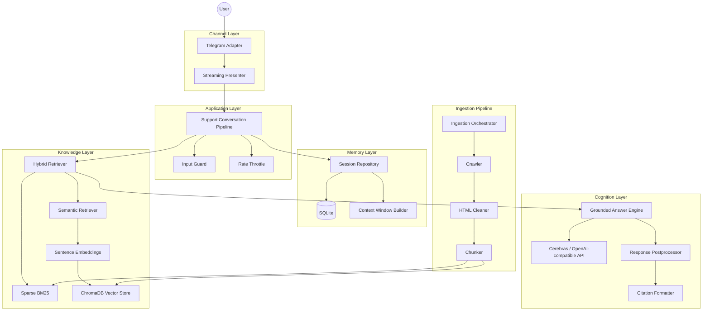

# AI-Powered Semantic Retrieval Platform for Company Support Automation

A production-oriented **MVP** that combines hybrid retrieval-augmented generation (RAG), grounded LLM inference, and a Telegram delivery channel to automate first-line company support. The system answers natural-language questions using evidence from crawled website content and a structured knowledge corpus — with mandatory citations, session memory, and guardrails against hallucination.

Built as a modular **hexagonal architecture** suitable for portfolio review, extension to additional channels (web widget, Slack), and swap-in of alternative vector stores or LLM providers.

---

## Highlights

| Capability | Implementation |
|------------|----------------|
| Hybrid RAG | BM25 sparse retrieval + dense semantic search fused via reciprocal rank fusion (RRF) |
| Vector store | ChromaDB persistent index with cosine similarity |
| Embeddings | `sentence-transformers` (multilingual MiniLM) |
| Ingestion | Multi-page web crawler → HTML cleaning → semantic chunking → index rebuild |
| Grounding | Evidence-only system prompts, numbered source fragments, citation footer on every reply |
| Memory | SQLite-backed sessions with rolling context window and conversation summaries |
| Channel | Telegram Bot API (natural chat, no commands, streaming responses) |
| Safety | Input validation, prompt-injection heuristics, per-session rate limiting |

**Reference deployment:** support assistant for [Центр Красок #1](https://centr-krasok.kz/) — a Kazakhstan-based paint & coatings retailer.

---

## Architecture Overview

The platform separates **domain logic** from **infrastructure adapters**. Business rules live in the conversation pipeline; Telegram, ChromaDB, Cerebras, and SQLite are plug-in implementations behind port interfaces.



### Layer Responsibilities

| Layer | Path | Role |
|-------|------|------|
| **Runtime** | `runtime/` | Configuration, dependency injection, process bootstrap |
| **Domain** | `domain/` | Entities (`KnowledgeFragment`, `SourceCitation`, `ChatTurn`) and port protocols |
| **Knowledge** | `knowledge/` | RAG retrieval, ChromaDB, BM25, evidence context building |
| **Cognition** | `cognition/` | LLM client, grounded prompts, citations, response post-processing |
| **Conversation** | `conversation/` | End-to-end inquiry orchestration (guard → retrieve → generate → remember) |
| **Memory** | `memory/` | SQLite persistence, rolling window, summaries, message search |
| **Safety** | `safety/` | Input guards and sliding-window throttling |
| **Ingestion** | `ingestion/` | Website crawl, clean, chunk, re-index |
| **Channels** | `channels/telegram/` | Thin Telegram adapter — no business logic |

---

## Hybrid RAG

Retrieval is the core of the platform. Each user query triggers a **hybrid search** over the company knowledge base:

1. **Semantic leg** — The query is embedded with `sentence-transformers/paraphrase-multilingual-MiniLM-L12-v2`. ChromaDB returns the top-*k* chunks by cosine similarity, with optional metadata filters (`language`, `section`, `source_url`).

2. **Sparse leg (optional)** — BM25 (`rank-bm25`) performs lexical matching over the same corpus exported to `data/company_knowledge.md`. Effective for exact brand names, phone numbers, and rare tokens.

3. **Fusion** — Reciprocal Rank Fusion (RRF) merges ranked lists from both retrievers into a single evidence set passed to the LLM.

```
Query ──┬──► Embedding ──► ChromaDB ──► semantic hits ──┐
        │                                                 ├──► RRF ──► Top-K fragments
        └──► Tokenize ──► BM25 ──► sparse hits ──────────┘
```

Configure via environment:

```env
RETRIEVAL_MODE=hybrid    # hybrid | semantic | sparse
ENABLE_BM25=true
RETRIEVAL_TOP_K=4
SEMANTIC_MIN_SCORE=0.35
HYBRID_RRF_K=60
```

Each chunk carries structured metadata: **title**, **section**, **source_url**, **language** — propagated through retrieval, prompting, and citations.

---

## Semantic Retrieval & ChromaDB

| Component | File | Description |
|-----------|------|-------------|
| Embeddings | `knowledge/embeddings.py` | `SentenceEmbeddingService` — batch document encoding, query encoding, L2-normalized vectors |
| Vector store | `knowledge/vector_store.py` | `ChromaVectorStore` — persistent collection, metadata-aware `query()`, corpus fingerprinting |
| Semantic retriever | `knowledge/semantic_retriever.py` | Async retrieval API with similarity threshold and metadata filters |
| Hybrid orchestrator | `knowledge/hybrid_retriever.py` | Wires sparse + semantic legs; implements `KnowledgeRetriever` port |

**Storage layout:**

```
data/chroma/                 # ChromaDB persistent directory
  └── company_knowledge      # Collection (cosine HNSW)
data/company_knowledge.md    # Markdown export for BM25 + human review
```

Indexes are rebuilt by the ingestion CLI or lazily on bot startup when the corpus hash changes.

---

## Ingestion Pipeline

A production-style pipeline keeps the knowledge base aligned with the live website:

```bash
python refresh_knowledge.py
python refresh_knowledge.py --seed https://example.com/about --max-pages 20 -v
```

| Stage | Module | What it does |
|-------|--------|--------------|
| Crawl | `ingestion/crawler.py` | BFS crawl of same-domain pages, rate-limited, noise URL filtering |
| Clean | `ingestion/html_cleaner.py` | Strip nav/footer/scripts, extract main content, normalize whitespace, detect language |
| Chunk | `ingestion/chunker.py` | Section-aware semantic chunks, overlap, SHA-based deduplication |
| Index | `ingestion/pipeline.py` | Export markdown → embed → ChromaDB upsert → rebuild BM25 |

Ingestion attaches full provenance metadata to every chunk and invalidates the vector index when content changes.

---

## Grounding, Citations & Hallucination Prevention

The system is designed so answers **demonstrate evidence grounding** rather than appearing as unconstrained generation.

### Evidence conditioning

- Retrieved fragments are injected into a strict system prompt as a numbered **«Доказательная база»** block.
- The model is instructed to answer only from that evidence and to use inline references `[1]`, `[2]`.
- Temperature is kept low (`0.2`) to reduce creative drift.

### Mandatory citations

Every grounded response passes through `cognition/postprocessor.py`:

1. Strip any duplicate source footers the model may have added.
2. Append a structured **«Источники»** block via `cognition/citations.py`.

Example output:

```
Доставка осуществляется до двери в Алматы [1].

📚 Источники (подтверждённые данные компании):
1. «О магазине» — раздел «Доставка и самовывоз»
   https://centr-krasok.kz/about
2. «Контакты»
   https://centr-krasok.kz/contacts
```

### Fallback when evidence is insufficient

If retrieval returns no relevant chunks above the similarity threshold, the pipeline returns a fixed fallback message and directs the user to phone / website — **without** calling the LLM on empty context.

### Additional guardrails

| Control | Location |
|---------|----------|
| Prompt-injection filtering | `safety/guards.py` |
| Per-session rate limiting | `safety/throttle.py` |
| Max input / output length | `runtime/settings.py` |
| Source map in system prompt | `cognition/prompts.py` |

---

## Memory System

Conversation state is stored in **SQLite** (`data/memory.db`), replacing legacy JSON files.

| Feature | Implementation |
|---------|----------------|
| Persistence | `memory/sqlite_store.py` — sessions, messages, summary history tables (WAL mode) |
| Repository | `memory/session_repository.py` — implements `SessionMemory` port; channel-agnostic |
| Rolling window | `memory/context_window.py` — last *N* turns to the LLM |
| Summaries | Older turns compressed into a rolling summary injected as a system message |
| Search | `search_history(session_id, query)` — keyword retrieval over full message history |

Legacy `sessions.json` / `dialogs.json` are auto-migrated on first startup.

---

## Telegram Integration

The Telegram layer is intentionally thin:

- **Natural language only** — no `/commands`; users send plain text.
- **Streaming UX** — responses stream token-by-token with live message edits (`ENABLE_STREAMING=true`).
- **Welcome message** on first contact in a session.
- **Inline actions** — call and website buttons via `channels/telegram/widgets.py`.

```
User message → adapter → presenter → pipeline → grounded reply → Telegram
```

All support logic remains in `conversation/pipeline.py`; swapping Telegram for another channel means implementing a new adapter against the same pipeline.

---

## Tech Stack

| Category | Technology |
|----------|------------|
| Language | Python 3.10+ |
| Bot framework | aiogram 3.x |
| LLM API | Cerebras (OpenAI-compatible client) |
| Embeddings | sentence-transformers |
| Vector DB | ChromaDB |
| Sparse retrieval | rank-bm25 |
| Memory | SQLite (stdlib) |
| HTTP / crawl | httpx, BeautifulSoup, lxml |
| Config | python-dotenv |

---

## Project Structure

```
.
├── run.py                      # Start the support bot
├── refresh_knowledge.py        # Rebuild knowledge index from website
├── runtime/                    # Settings + composition root
├── domain/                     # Models + port interfaces
├── knowledge/                  # Hybrid RAG, ChromaDB, embeddings
├── cognition/                  # LLM, prompts, citations, postprocessor
├── conversation/               # Inquiry pipeline
├── memory/                     # SQLite session store
├── safety/                     # Guards + throttle
├── ingestion/                  # Web crawl → index pipeline
├── channels/telegram/          # Bot adapter + presenter
└── data/
    ├── company_knowledge.md    # Exported corpus (BM25 + review)
    ├── chroma/                 # Vector index (gitignored)
    └── memory.db               # Session store (gitignored)
```

---

## Setup & Deployment

### Prerequisites

- Python 3.10 or newer
- Telegram Bot Token ([@BotFather](https://t.me/BotFather))
- Cerebras API key (or any OpenAI-compatible endpoint)
- ~2 GB disk for embedding model cache (first run)

### 1. Clone and install

```bash
git clone <repository-url>
cd AItelegram

python3 -m venv .venv
source .venv/bin/activate        # Windows: .venv\Scripts\activate
pip install -r requirements.txt
```

### 2. Configure environment

```bash
cp .env.example .env
```

Required variables:

| Variable | Description |
|----------|-------------|
| `TELEGRAM_BOT_TOKEN` | Telegram bot token |
| `LLM_API_KEY` | Cerebras / OpenAI-compatible API key |

See `.env.example` for retrieval, ingestion, memory, and safety tuning.

### 3. Build the knowledge index

Crawl the company website and rebuild ChromaDB + BM25:

```bash
python refresh_knowledge.py
```

First run downloads the embedding model and may take 1–3 minutes. Subsequent runs reuse the index when the corpus hash is unchanged.

Alternatively, maintain `data/company_knowledge.md` manually (markdown `##` sections) and restart the bot — the index rebuilds on startup.

### 4. Run the assistant

```bash
python run.py
```

The bot starts long-polling Telegram. Users send questions in natural language; responses are grounded, cited, and streamed when enabled.

### Deploy on Render

This repo includes a [`render.yaml`](render.yaml) Blueprint for a **Background Worker** (Telegram long-polling).

1. Push the repository to GitHub (see commands below).
2. In [Render](https://render.com) → **New** → **Blueprint** → connect `company-support-ai-platform`.
3. Set secret environment variables in the dashboard:
   - `TELEGRAM_BOT_TOKEN`
   - `OPENAI_API_KEY` (or `LLM_API_KEY` / Cerebras key)
4. Deploy. First boot builds the Chroma index from `data/company_knowledge.md` (~2–5 min).

| Render setting | Value |
|----------------|-------|
| Service type | **Background Worker** (not Web Service) |
| Build command | `pip install -r requirements.txt` |
| Start command | `python run.py` |
| Python version | `3.11.9` (`runtime.txt`) |

**Note:** Render disks are ephemeral unless you add a persistent disk. Session SQLite and Chroma indexes reset on redeploy unless you attach storage or re-run `refresh_knowledge.py`.

### Deployment notes (general)

| Concern | Recommendation |
|---------|----------------|
| Secrets | Use Render env vars / GitHub Secrets — **never commit `.env`** |
| Persistence | Attach Render disk or external DB for `data/` across deploys |
| Index updates | Cron job or manual `refresh_knowledge.py` after site changes |
| Logs | stdout; tokens redacted in `runtime/logging_config.py` |

### Safe GitHub publishing

Tracked in git: source code, `data/company_knowledge.md`, `.env.example`, `render.yaml`.  
**Never tracked:** `.env`, `.venv/`, `data/chroma/`, `data/memory.db*`, logs.

```bash
# Verify before push
git check-ignore -v .env .venv data/chroma data/memory.db
git status
```

---

## Configuration Reference

| Group | Key variables |
|-------|----------------|
| LLM | `LLM_API_KEY`, `LLM_BASE_URL`, `LLM_MODEL`, `LLM_TEMPERATURE` |
| Retrieval | `RETRIEVAL_MODE`, `ENABLE_BM25`, `RETRIEVAL_TOP_K`, `SEMANTIC_MIN_SCORE` |
| Embeddings / Chroma | `EMBEDDING_MODEL`, `CHROMA_COLLECTION` |
| Ingestion | `INGESTION_SEED_URLS`, `CRAWL_MAX_PAGES`, `CHUNK_MAX_CHARS` |
| Memory | `MAX_SESSION_TURNS`, `MEMORY_SUMMARY_MAX_CHARS` |
| Citations | `CITATION_INCLUDE_URLS` |
| Safety | `THROTTLE_MAX_REQUESTS`, `THROTTLE_WINDOW_SEC` |

Legacy aliases `BOT_TOKEN` and `CEREBRAS_API_KEY` remain supported for backward compatibility.

---

## Example Interactions

Users can ask (Russian, natural language):

- *Чем занимается компания?*
- *Какие бренды красок есть в ассортименте?*
- *Где салоны в Алматы и Астане?*
- *Есть ли программа для дизайнеров?*
- *Как оформить доставку?*

The assistant responds from retrieved evidence with numbered sources — not from parametric knowledge alone.

---

## Design Principles

1. **Evidence first** — Retrieval precedes generation; empty context skips the LLM.
2. **Modular boundaries** — Ports in `domain/ports.py`; adapters are swappable.
3. **Observable grounding** — Citations are post-processed, not optional.
4. **Channel independence** — Telegram is one adapter; core logic is reusable.
5. **Operable MVP** — CLI ingestion, SQLite memory, persistent Chroma, env-driven config.

---

## License

Private / portfolio MVP. Adjust licensing before public distribution.
